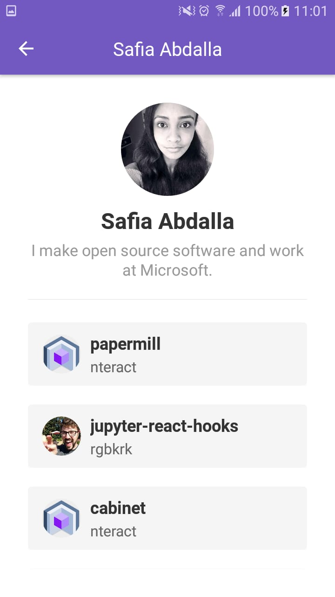
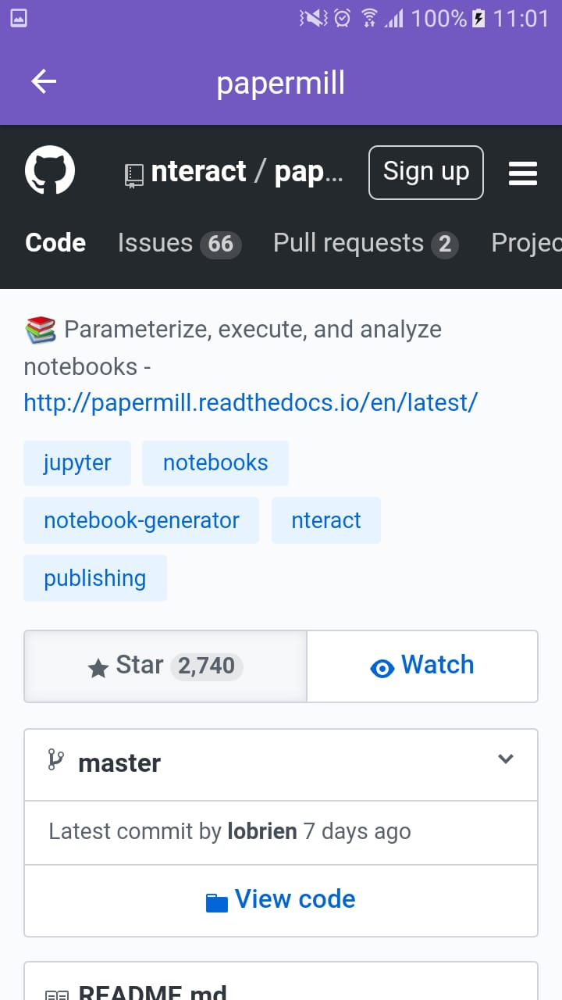

# Mini Github App

## Instalar

```
yarn
```

## Executar app

Execute o seguinte comando e deixe o em um terminal separado:
```
react-native start --reset-cache
```
Para iniciar o app, execute o seguinte:
```
react-native run-android
```

## Demo




